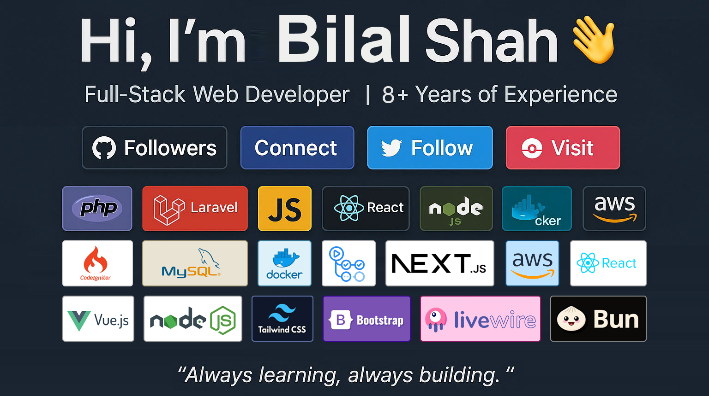

<h1 align="center"># 👋 Hi, I’m Syed Bilal Ahmed Shah</h1>

Senior Full Stack Software Engineer focused on building and scaling SaaS platforms, API-driven systems, and AI-enabled products.

I work end-to-end across frontend and backend systems from architecture and development to deployment, optimization, and long-term maintainability. My work emphasizes clean code, scalable design, and strong developer experience.

## 🚀 What I Focus On
- 🧱 Scalable SaaS architectures
- 🔌 API design & integrations (REST, GraphQL)
- ⚙️ Laravel & PHP backend systems
- 🤖 AI-driven workflows & system optimization
- 🛠 Production reliability & performance

## 🧰 Tech Stack

  
  
  
    
  
  
  
  
  
  
  
  
  
  
  

**Frontend**
- React, TypeScript, JavaScript, VueJs, Livewire
- Tailwind CSS, Bootstrap

**Backend**
- Laravel, PHP
- Node.js, Bun

**APIs & Realtime**
- REST APIs, GraphQL
- WebSockets, Redis

**Databases**
- MySQL, PostgreSQL
- SQL Server (MSSQL)
- MongoDB
- Firebase

**Cloud & DevOps**
- AWS
- CI/CD, Deployment, Infrastructure Optimization

## 📦 Open Source
- ⭐ Laravel Starter Kit — production-ready Laravel starter kit for CMS and content-driven applications

## 🧠 Beyond Code
- Architecture & system design
- Mentoring & best practices
- Agile / Scrum collaboration
- Leveraging AI to improve engineering workflows
